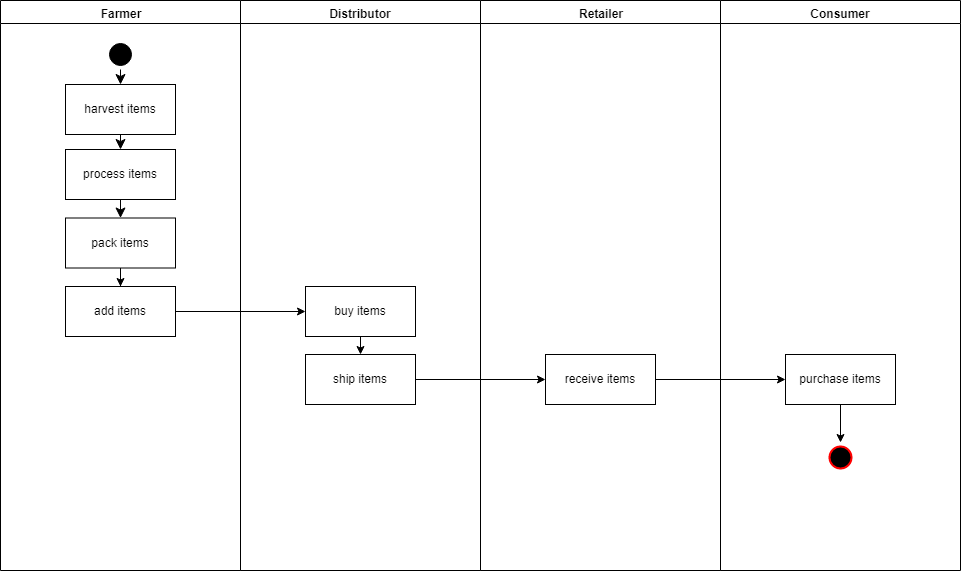
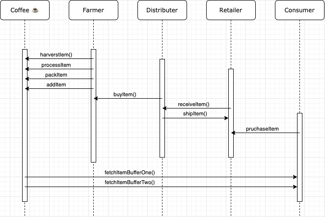
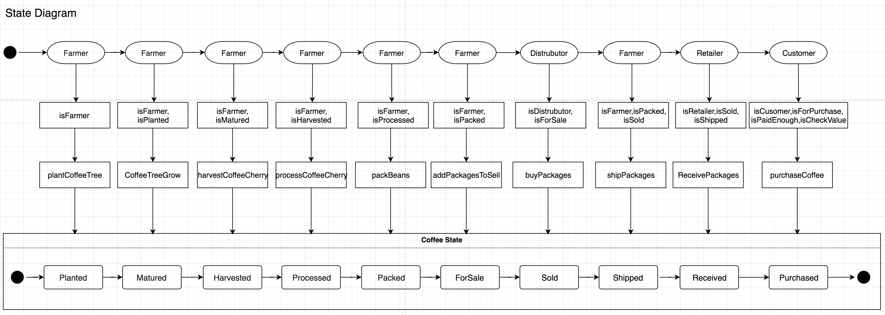
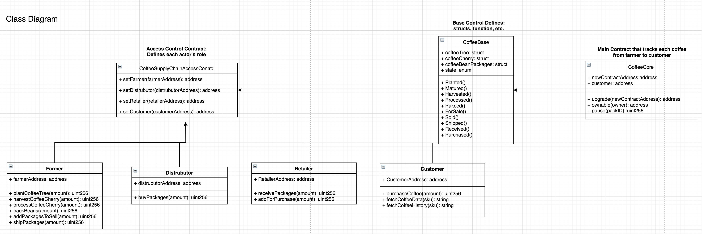

# Supply chain & data auditing

This repository containts an Ethereum DApp that demonstrates a Supply Chain flow between a Seller and Buyer. The user story is similar to any commonly used supply chain process. A Seller can add items to the inventory system stored in the blockchain. A Buyer can purchase such items from the inventory system. Additionally a Seller can mark an item as Shipped, and similarly a Buyer can mark an item as Received.

## Contract Addresses (Ropsten network)

- FarmerRole: [0x21898eD4e7780C32e2D96c815974060685B8365D](https://ropsten.etherscan.io/address/0x21898eD4e7780C32e2D96c815974060685B8365D)
- DistributorRole: [0x4A94207DE86cd46c0612a4d94b3a19BAb57bf895](https://ropsten.etherscan.io/address/0x4A94207DE86cd46c0612a4d94b3a19BAb57bf895)
- RetailerRole: [0x5DD68217Dc2F83985804Fb4faF5AA798CFD55724](https://ropsten.etherscan.io/address/0x5DD68217Dc2F83985804Fb4faF5AA798CFD55724)
- ConsumerRole: [0xf0A87AC007280931251d55414A427Cb66D5DAb7F](https://ropsten.etherscan.io/address/0xf0A87AC007280931251d55414A427Cb66D5DAb7F)
- SupplyChain: [0x018c34b18DDB3477dBA28A2D9508d2b65B1dE6bf](https://ropsten.etherscan.io/address/0x018c34b18DDB3477dBA28A2D9508d2b65B1dE6bf)

## Libraries

- Truffle (v5.1.32) - To develop,test and deploy smart contracts.
- truffle-hdwallet-provider (v1.0.17) - Use it to sign transactions for addresses derived from a 12-word mnemonic.
- yarn (v1.22.4) - Fast, reliable, and secure dependency node manager.

## Project write-up

### Activity



### Sequence



### State



### Class



## Deployment

```
truffle(develop)> truffle deploy --network ropsten

Compiling your contracts...
===========================
> Everything is up to date, there is nothing to compile.


Starting migrations...
======================
> Network name:    'ropsten'
> Network id:      3
> Block gas limit: 8000029 (0x7a121d)


2_deploy_contracts.js
=====================

   Deploying 'FarmerRole'
   ----------------------
   > transaction hash:    0x95f6c99758a4f0f922430666475aa070a853f4865523a0d357b3b83574758ff3
   > Blocks: 1            Seconds: 20
   > contract address:    0x21898eD4e7780C32e2D96c815974060685B8365D
   > block number:        8328480
   > block timestamp:     1595203190
   > account:             0x28d06E693F5fbA5C8821cD6Ebf2f5245DCb6bfB6
   > balance:             5.931180469
   > gas used:            328218 (0x5021a)
   > gas price:           20 gwei
   > value sent:          0 ETH
   > total cost:          0.00656436 ETH

   Pausing for 2 confirmations...
   ------------------------------
truffle(develop)>    > confirmation number: 3 (block: 8328483)

   Deploying 'DistributorRole'
   ---------------------------
   > transaction hash:    0x43d3b3002ac9421c434e2de1199c42596f0f6e51e09d8139239430cb0c2a572f
   > Blocks: 1            Seconds: 36
   > contract address:    0x4A94207DE86cd46c0612a4d94b3a19BAb57bf895
   > block number:        8328485
   > block timestamp:     1595203243
   > account:             0x28d06E693F5fbA5C8821cD6Ebf2f5245DCb6bfB6
   > balance:             5.924615149
   > gas used:            328266 (0x5024a)
   > gas price:           20 gwei
   > value sent:          0 ETH
   > total cost:          0.00656532 ETH

   Pausing for 2 confirmations...
   ------------------------------
   > confirmation number: 1 (block: 8328486)
   > confirmation number: 2 (block: 8328487)

   Deploying 'RetailerRole'
   ------------------------
   > transaction hash:    0x09c445277e0607d4dd7d0cb946e35b076d77fb76f48989a57fdf2c85c803d22b
   > Blocks: 0            Seconds: 12
   > contract address:    0x5DD68217Dc2F83985804Fb4faF5AA798CFD55724
   > block number:        8328488
   > block timestamp:     1595203304
   > account:             0x28d06E693F5fbA5C8821cD6Ebf2f5245DCb6bfB6
   > balance:             5.918050549
   > gas used:            328230 (0x50226)
   > gas price:           20 gwei
   > value sent:          0 ETH
   > total cost:          0.0065646 ETH

   Pausing for 2 confirmations...
   ------------------------------
   > confirmation number: 1 (block: 8328489)
   > confirmation number: 2 (block: 8328490)

   Deploying 'ConsumerRole'
   ------------------------
   > transaction hash:    0xc36352c42bd90b86d370ea4389f90dcf4050b0c8053a9806d9ac19a17630a7a4
   > Blocks: 1            Seconds: 8
   > contract address:    0xf0A87AC007280931251d55414A427Cb66D5DAb7F
   > block number:        8328492
   > block timestamp:     1595203345
   > account:             0x28d06E693F5fbA5C8821cD6Ebf2f5245DCb6bfB6
   > balance:             5.911485709
   > gas used:            328242 (0x50232)
   > gas price:           20 gwei
   > value sent:          0 ETH
   > total cost:          0.00656484 ETH

   Pausing for 2 confirmations...
   ------------------------------
   > confirmation number: 1 (block: 8328493)
   > confirmation number: 2 (block: 8328494)

   Deploying 'SupplyChain'
   -----------------------
   > transaction hash:    0x7f5c0bf8b3a921783389d0ad0b17d381d50f8e7574f3bc4d89cd0e3887223033
   > Blocks: 0            Seconds: 4
   > contract address:    0x018c34b18DDB3477dBA28A2D9508d2b65B1dE6bf
   > block number:        8328495
   > block timestamp:     1595203407
   > account:             0x28d06E693F5fbA5C8821cD6Ebf2f5245DCb6bfB6
   > balance:             5.856026449
   > gas used:            2772963 (0x2a4fe3)
   > gas price:           20 gwei
   > value sent:          0 ETH
   > total cost:          0.05545926 ETH

   Pausing for 2 confirmations...
   ------------------------------
   > confirmation number: 1 (block: 8328496)
   > confirmation number: 2 (block: 8328497)

   > Saving migration to chain.
   > Saving artifacts
   -------------------------------------
   > Total cost:          0.08171838 ETH


Summary
=======
> Total deployments:   5
> Final cost:          0.08171838 ETH
```
