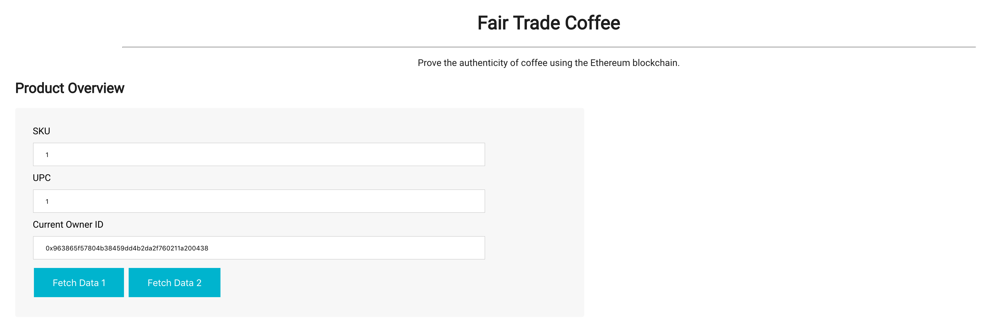
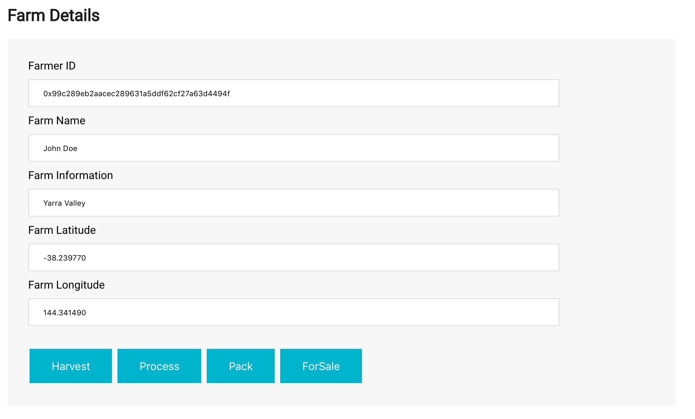
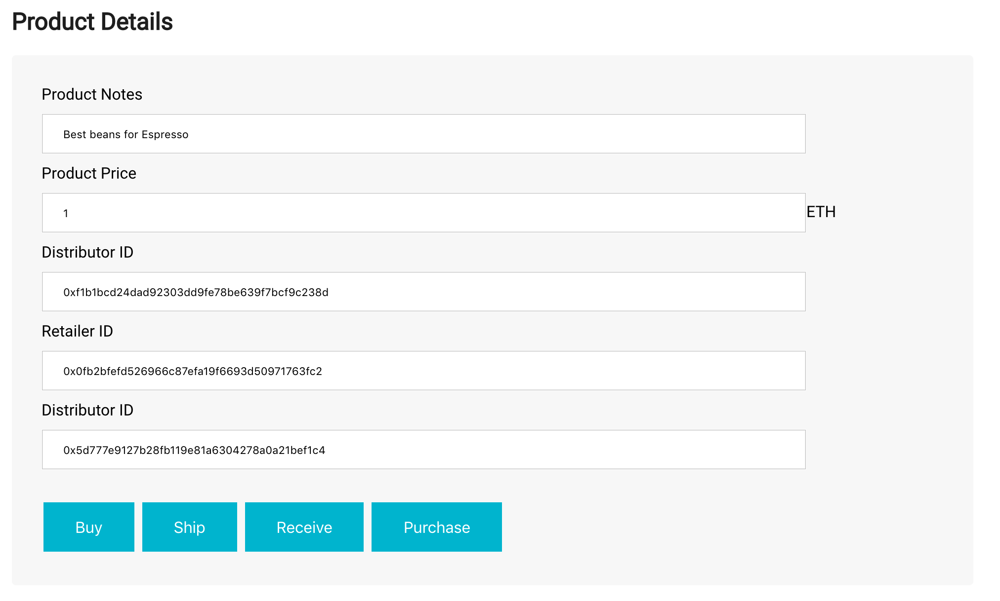
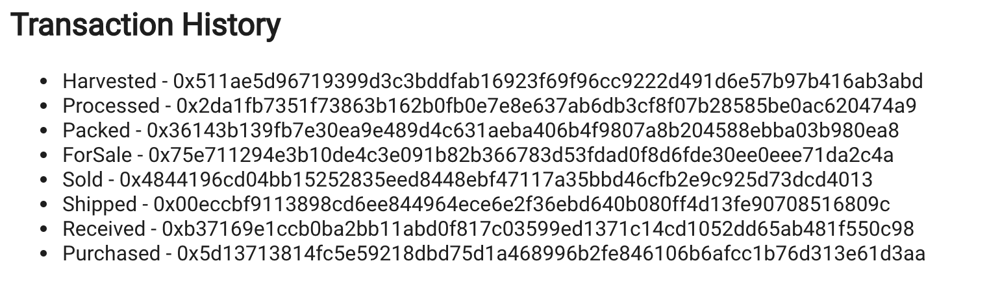
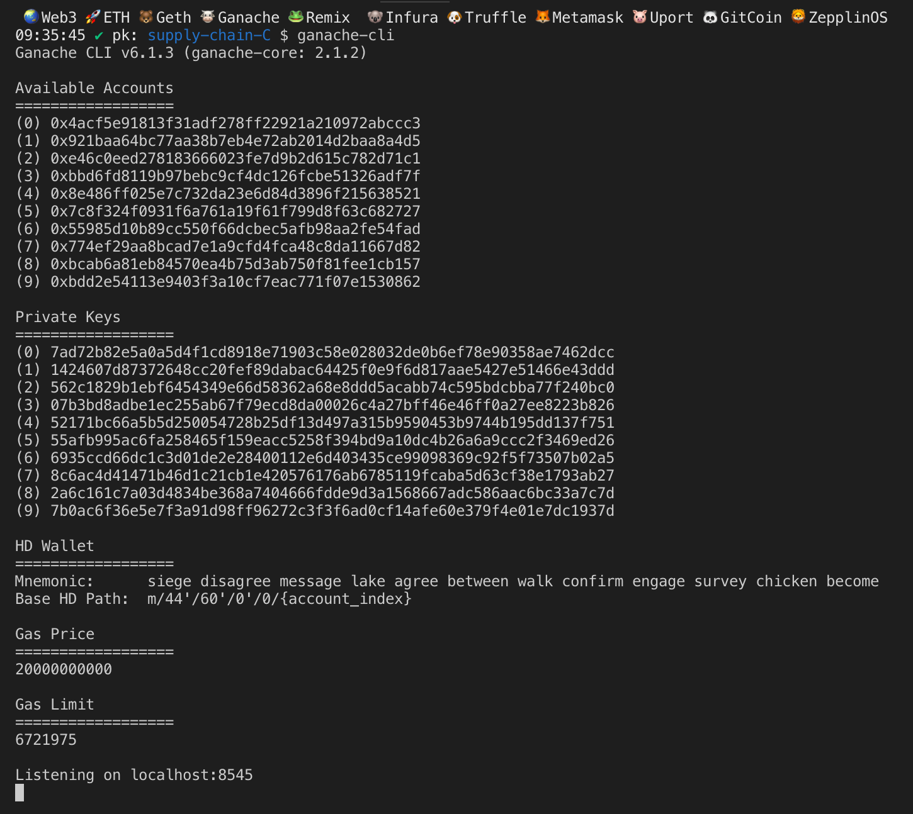
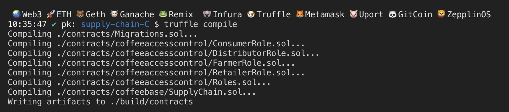
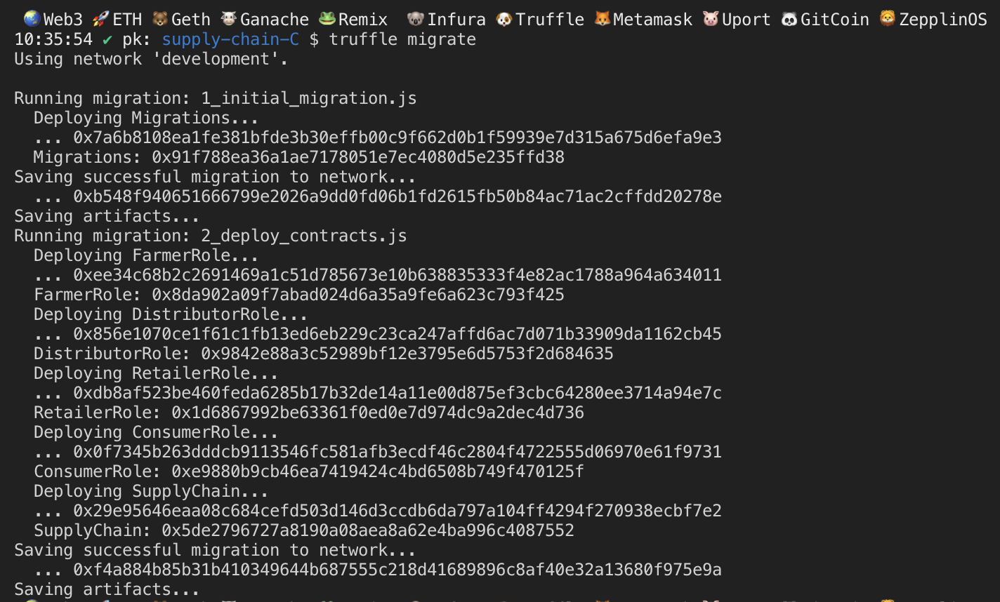
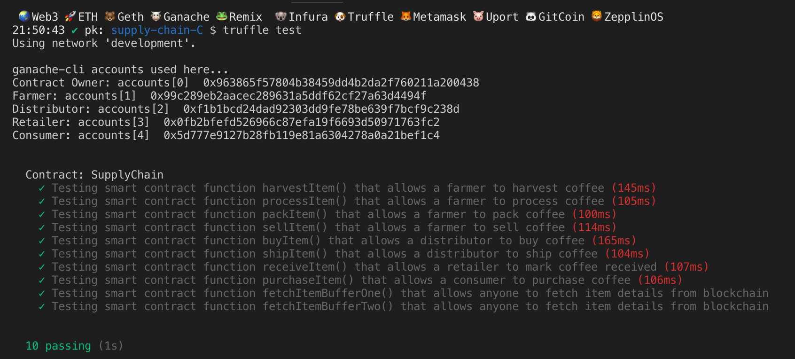

# Supply chain & data auditing

This repository containts an Ethereum DApp that demonstrates a Supply Chain flow between a Seller and Buyer. The user story is similar to any commonly used supply chain process. A Seller can add items to the inventory system stored in the blockchain. A Buyer can purchase such items from the inventory system. Additionally a Seller can mark an item as Shipped, and similarly a Buyer can mark an item as Received.

## Contract Addresses (Ropsten network)

- FarmerRole: [0x21898eD4e7780C32e2D96c815974060685B8365D](https://ropsten.etherscan.io/address/0x21898eD4e7780C32e2D96c815974060685B8365D)
- DistributorRole: [0x4A94207DE86cd46c0612a4d94b3a19BAb57bf895](https://ropsten.etherscan.io/address/0x4A94207DE86cd46c0612a4d94b3a19BAb57bf895)
- RetailerRole: [0x5DD68217Dc2F83985804Fb4faF5AA798CFD55724](https://ropsten.etherscan.io/address/0x5DD68217Dc2F83985804Fb4faF5AA798CFD55724)
- ConsumerRole: [0xf0A87AC007280931251d55414A427Cb66D5DAb7F](https://ropsten.etherscan.io/address/0xf0A87AC007280931251d55414A427Cb66D5DAb7F)
- SupplyChain: [0x018c34b18DDB3477dBA28A2D9508d2b65B1dE6bf](https://ropsten.etherscan.io/address/0x018c34b18DDB3477dBA28A2D9508d2b65B1dE6bf)

## Libraries

- Truffle (v5.1.32)
- Solidity (v0.5.16)
- Node (v12.10.0)
- Web3.js

## Project write-up

### Activity


### Sequence


### State


### Class


The DApp User Interface when running should look like...









## Getting Started

These instructions will get you a copy of the project up and running on your local machine for development and testing purposes. See deployment for notes on how to deploy the project on a live system.

### Prerequisites

Please make sure you've already installed ganache-cli, Truffle and enabled MetaMask extension in your browser.

```
Give examples (to be clarified)
```

### Installing

A step by step series of examples that tell you have to get a development env running

Clone this repository:

```
git clone https://github.com/udacity/nd1309/tree/master/course-5/project-6
```

Change directory to `project-6` folder and install all requisite npm packages (as listed in `package.json`):

```
cd project-6
npm install
```

Launch Ganache:

```
ganache-cli -m "spirit supply whale amount human item harsh scare congress discover talent hamster"
```

Your terminal should look something like this:



In a separate terminal window, Compile smart contracts:

```
truffle compile
```

Your terminal should look something like this:



This will create the smart contract artifacts in folder `build\contracts`.

Migrate smart contracts to the locally running blockchain, ganache-cli:

```
truffle migrate
```

Your terminal should look something like this:



Test smart contracts:

```
truffle test
```

All 10 tests should pass.



In a separate terminal window, launch the DApp:

```
npm run dev
```

## Built With

- [Ethereum](https://www.ethereum.org/) - Ethereum is a decentralized platform that runs smart contracts
- [IPFS](https://ipfs.io/) - IPFS is the Distributed Web | A peer-to-peer hypermedia protocol
  to make the web faster, safer, and more open.
- [Truffle Framework](http://truffleframework.com/) - Truffle is the most popular development framework for Ethereum with a mission to make your life a whole lot easier.

## Authors

See also the list of [contributors](https://github.com/your/project/contributors.md) who participated in this project.

## Acknowledgments

- Solidity
- Ganache-cli
- Truffle
- IPFS
